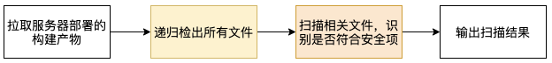
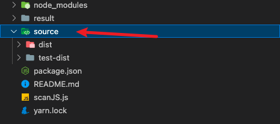
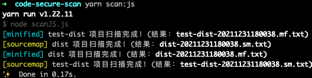
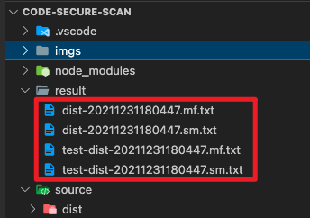
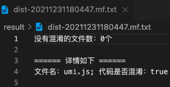
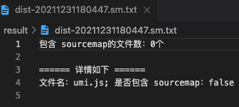

# 代码安全检测

## 1 背景
业务需要保障应用的安全问题，其中涉及到前端的代码安全，需要满足：
1. 部署到生产环境的代码需要混淆
2. 生成环境代码不能包含 sourcemap

一开始使用传统的人工检测，发现问题：
1. 在浏览器通过页面访问识别，很难覆盖产品涉及的所有页面(产品迭代、项目重构等影响)
2. 人工操作识别，效率低；容易主观判断，没有标准

为解决上述问题，制定自动检测的方案

## 2 检测方案
### 2.1 检测流程

- 直接检测部署的构建产物，可以全面覆盖检测影响范围
- 递归平铺产物目录的文件，抹平不同框架生成的构建产物的目录差异
- 根据安全项的标准，开发脚本自动识别相关文件



**【混淆标准】**

使用 [is-minified-code](https://github.com/MartinKolarik/is-minified-code) 库识别代码是否混淆

**【sourcemap 识别标准】**

根据 sourcemap 的打包原理，分两步识别：
1. 匹配源码文件中的 sourceMappingURL 标识，识别关联的 sourcemap 文件地址
2. 扫描构建物中是否包含步骤一的 sourcemap 文件，如果包含则认为应用暴露了 sourcemap 文件

### 2.2 项目使用
1. 检测源。手动在根目录创建 source 文件夹，放置待检测的构建产物，以文件夹的方式存放，文件名为项目名，如：



2. 运行项目
```shell
# 安装依赖
yarn

# 运行脚本
# type 为检测类型，值为: mf(混淆)、sm(sourcemap)，默认不传，执行两种类型的检测。
yarn scan:js type

```


3. 检测完终端数据相关信息



## 2.3 检测结果
- 结果文件存放在 result/ 目录下；文件名的格式：项目名 + 扫描时间 + 扫描类型
- 结果文件的第一部分为总的检测情况；第二部分为每个文件的检测情况，列出文件名 + 检查符合信息







